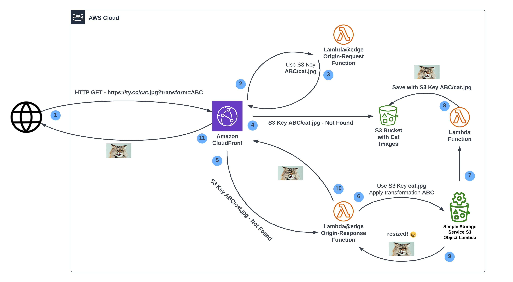

# Optimized Image Delivery

This is the implementation of the [Programmatic Image Conversion to WebP Using Amazon S3, CloudFront, and Lambda](https://caylent.com/blog/converting-images-to-webp-using-s3-object-lambda) blog post written by the Caylent team.

The [architecture](https://lucid.app/documents/view/a2c23ff5-22e5-4c31-9b27-a5d74ecbb700) is as follows:



After the pre-requisites are taken care of, you can deploy the stack by running:

```bash
npx cdk deploy
```

## Pre-requisites

* Ensure the following environment variables are set:
  * `CDK_DEFAULT_ACCOUNT` -> AWS Account ID
  * `CDK_DEFAULT_REGION` -> AWS Region
  * `APEX_DOMAIN` -> The root domain name you want to set in the CloudFront distribution, for example: `example.com`
  * `SUBDOMAIN` -> The subdomain you want to set in the CloudFront distribution, for example: `www`
  * `STACK_ID` -> A unique identifier for the stack, for example: `main` or `dev`
* [AWS CDK](https://docs.aws.amazon.com/cdk/latest/guide/getting_started.html) version 2.90.0 or higher.
* [Node.js](https://nodejs.org/en/) version 18.
* [Docker](https://www.docker.com/) version 24.0.5 or higher.

## How to use it?

After the stack is deployed, you can upload images to the S3 bucket created by the stack. The images 
will be automatically resized and optimized by the Lambda function and stored in the same bucket.

You can access the images by going to the CloudFront distribution URL, for example: `https://www.example.com/image.jpg`.

And the same image but resized by going to the CloudFront distribution URL but with a query parameter naming the desired transformation, for example: `https://www.example.com/image.jpg?transformation-template=webp-20230802-920`.
